<div align="center">

# 🚀 Uranus Group - Plateforme Web Professionnelle

<div>
  
  
  
  
  
</div>

### ✨ Plateforme complète pour QHSE & Informatique avec Chatbot IA

[](./PENTEST_REPORT.md)
[](LICENSE)
[](./PRODUCTION_READY.md)

---

</div>

## 📑 Table des Matières

- [🎯 Vue d'ensemble](#-vue-densemble)
- [✨ Fonctionnalités](#-fonctionnalités)
- [🛠️ Technologies](#️-technologies)
- [🚀 Installation](#-installation)
- [⚙️ Configuration](#️-configuration)
- [📱 Utilisation](#-utilisation)
- [🤖 Chatbot IA](#-chatbot-ia)
- [🔒 Sécurité](#-sécurité)
- [📊 Architecture](#-architecture)
- [🌐 Déploiement](#-déploiement)
- [🧪 Tests](#-tests)
- [📚 Documentation](#-documentation)

---

## 🎯 Vue d'ensemble

**Uranus Group** est une plateforme web moderne et complète développée avec Django, spécialement conçue pour les entreprises spécialisées en **QHSE (Qualité, Hygiène, Sécurité, Environnement)** et **Informatique**.

### 📊 Schéma Global du Système

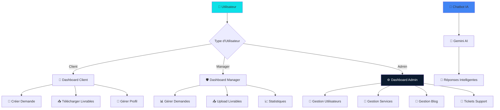

### 🎨 Caractéristiques Principales

<div align="center">

```
┌─────────────────────────────────────────────────────────────┐
│                                                             │
│  🎯 INTERFACE MODERNE                                       │
│  ├─ Animations GSAP & AOS                                  │
│  ├─ Design Responsive                                      │
│  └─ UX Optimisée                                            │
│                                                             │
│  🤖 CHATBOT IA                                              │
│  ├─ Google Gemini Integration                               │
│  ├─ Réponses Intelligentes                                 │
│  └─ Disponible 24/7                                        │
│                                                             │
│  📊 DASHBOARD COMPLET                                       │
│  ├─ Statistiques Temps Réel                                │
│  ├─ Graphiques Interactifs                                 │
│  └─ Gestion Centralisée                                     │
│                                                             │
│  🔐 SÉCURITÉ RENFORCÉE                                      │
│  ├─ CSRF Protection                                        │
│  ├─ XSS Protection                                          │
│  └─ SQL Injection Protection                               │
│                                                             │
└─────────────────────────────────────────────────────────────┘
```

</div>

---

## ✨ Fonctionnalités

### 🌐 Frontend Public

<details>
<summary><b>📊 Schéma Frontend - Cliquez pour voir</b></summary>

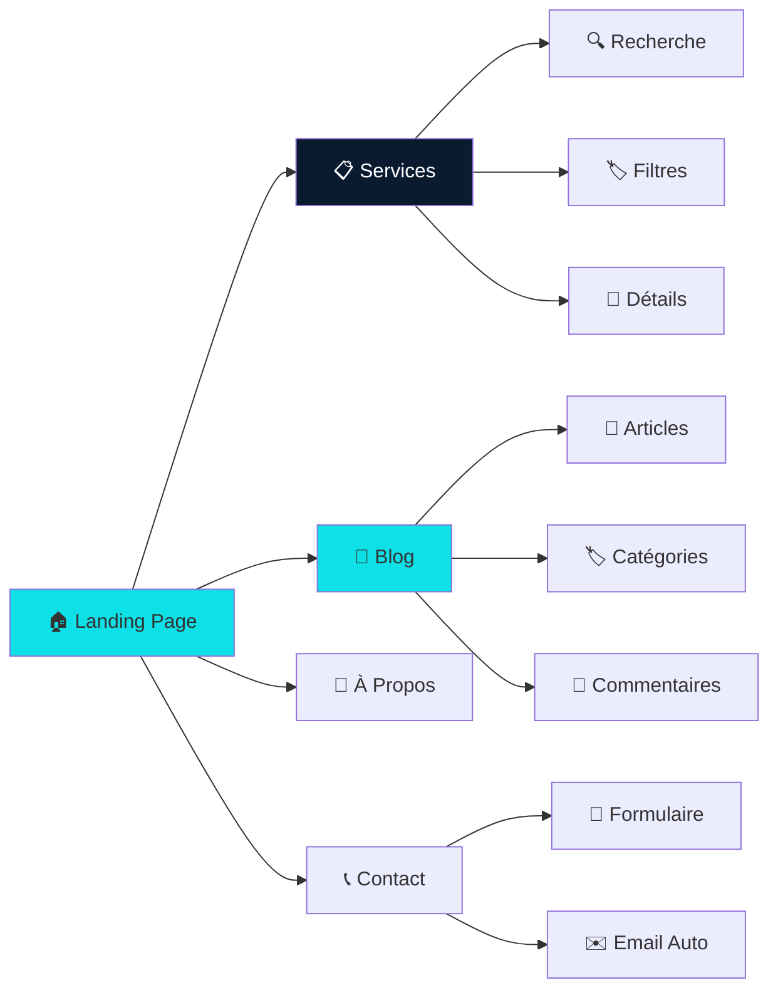

</details>

#### 🏠 Landing Page

```
┌─────────────────────────────────────────────────┐
│  🎠 SLIDER ANIMÉ                                 │
│  ├─ Images dynamiques                           │
│  ├─ Transitions fluides                         │
│  └─ Call-to-action                              │
│                                                  │
│  📦 SECTIONS QHSE/INFO                          │
│  ├─ Services mis en avant                       │
│  ├─ Descriptions détaillées                    │
│  └─ Liens vers pages dédiées                    │
│                                                  │
│  🏆 CERTIFICATIONS                              │
│  ├─ Logos ISO                                   │
│  ├─ Badges qualité                              │
│  └─ Descriptions                                 │
│                                                  │
│  💬 TÉMOIGNAGES                                 │
│  ├─ Avis clients                                │
│  ├─ Notes 5 étoiles                             │
│  └─ Photos et citations                         │
└─────────────────────────────────────────────────┘
```

#### 📋 Services

<div align="center">

```
┌──────────────┐     ┌──────────────┐     ┌──────────────┐
│  🔍 RECHERCHE │ --> │  🏷️ FILTRES  │ --> │  📋 RÉSULTATS│
└──────────────┘     └──────────────┘     └──────────────┘
       │                    │                    │
       └────────────────────┴────────────────────┘
                            │
                            ▼
                   ┌─────────────────┐
                   │  📄 PAGE DÉTAIL  │
                   │  ├─ Description  │
                   │  ├─ Prix         │
                   │  └─ Durée        │
                   └─────────────────┘
```

</div>

#### 📰 Blog/CMS

```
┌──────────────────────────────────────────────┐
│  📝 ARTICLES                                 │
│  ├─ Titre                                    │
│  ├─ Auteur                                   │
│  ├─ Date                                     │
│  ├─ Catégorie                                │
│  ├─ Image mise en avant                      │
│  ├─ Contenu riche                            │
│  └─ Compteur de vues                         │
│                                              │
│  🏷️ CATÉGORIES                              │
│  ├─ Filtrage par catégorie                  │
│  ├─ Recherche                                │
│  └─ Pagination                               │
└──────────────────────────────────────────────┘
```

### 👤 Espace Client

<details>
<summary><b>📊 Schéma Dashboard Client - Cliquez pour voir</b></summary>

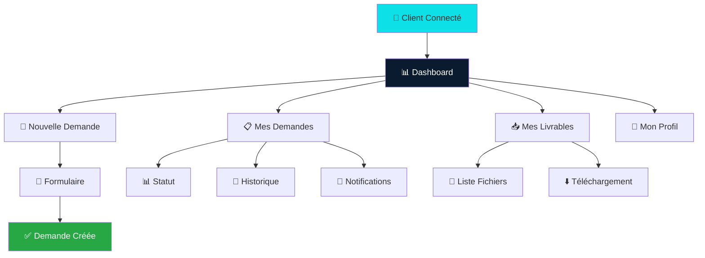

</details>

#### 📊 Tableau Récapitulatif

| Fonctionnalité | Description | Statut |
|---------------|-------------|--------|
| 🎯 **Dashboard** | Vue d'ensemble personnalisée | ✅ |
| 📝 **Créer Demande** | Formulaire de demande de service | ✅ |
| 📋 **Mes Demandes** | Liste et suivi des demandes | ✅ |
| 📥 **Livrables** | Téléchargement des fichiers | ✅ |
| 👤 **Profil** | Gestion du compte utilisateur | ✅ |
| 🔔 **Notifications** | Alertes et mises à jour | ✅ |

### 🛡️ Espace Admin

<details>
<summary><b>📊 Schéma Dashboard Admin - Cliquez pour voir</b></summary>

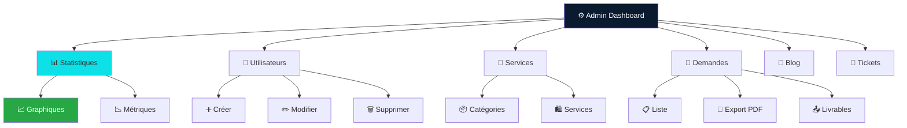

</details>

#### 📊 Fonctionnalités Admin

```
┌──────────────────────────────────────────────────────────┐
│  📊 DASHBOARD PRINCIPAL                                   │
│  ├─ 📈 Statistiques en temps réel                        │
│  ├─ 📉 Graphiques Chart.js                               │
│  ├─ 📋 Demandes récentes                                 │
│  └─ ⚡ Actions rapides                                    │
│                                                          │
│  👥 GESTION UTILISATEURS                                 │
│  ├─ ➕ Création                                          │
│  ├─ ✏️ Modification                                     │
│  ├─ 🗑️ Suppression                                       │
│  ├─ 🔐 Gestion des rôles                                 │
│  └─ 📸 Gestion des avatars                               │
│                                                          │
│  💼 GESTION SERVICES                                    │
│  ├─ 📦 Catégories (CRUD)                                 │
│  ├─ 🛍️ Services (CRUD)                                   │
│  ├─ 💰 Prix et durées                                    │
│  └─ 🖼️ Images                                            │
│                                                          │
│  📝 GESTION DEMANDES                                     │
│  ├─ 📋 Liste complète                                    │
│  ├─ 👤 Assignation                                       │
│  ├─ 📊 Statuts et priorités                             │
│  ├─ 📄 Export PDF                                        │
│  └─ 📤 Gestion livrables                                 │
│                                                          │
│  📰 GESTION BLOG                                         │
│  ├─ 📝 Articles (CRUD)                                   │
│  ├─ 🏷️ Catégories                                        │
│  ├─ 🖼️ Images                                            │
│  └─ 📊 Statistiques                                      │
│                                                          │
│  🎫 GESTION TICKETS                                      │
│  ├─ 📋 Liste tickets                                     │
│  ├─ 💬 Messages                                         │
│  ├─ 👤 Assignation                                       │
│  └─ ✅ Résolution                                        │
└──────────────────────────────────────────────────────────┘
```

### 🤖 Chatbot IA Gemini

<details>
<summary><b>📊 Schéma Architecture Chatbot - Cliquez pour voir</b></summary>

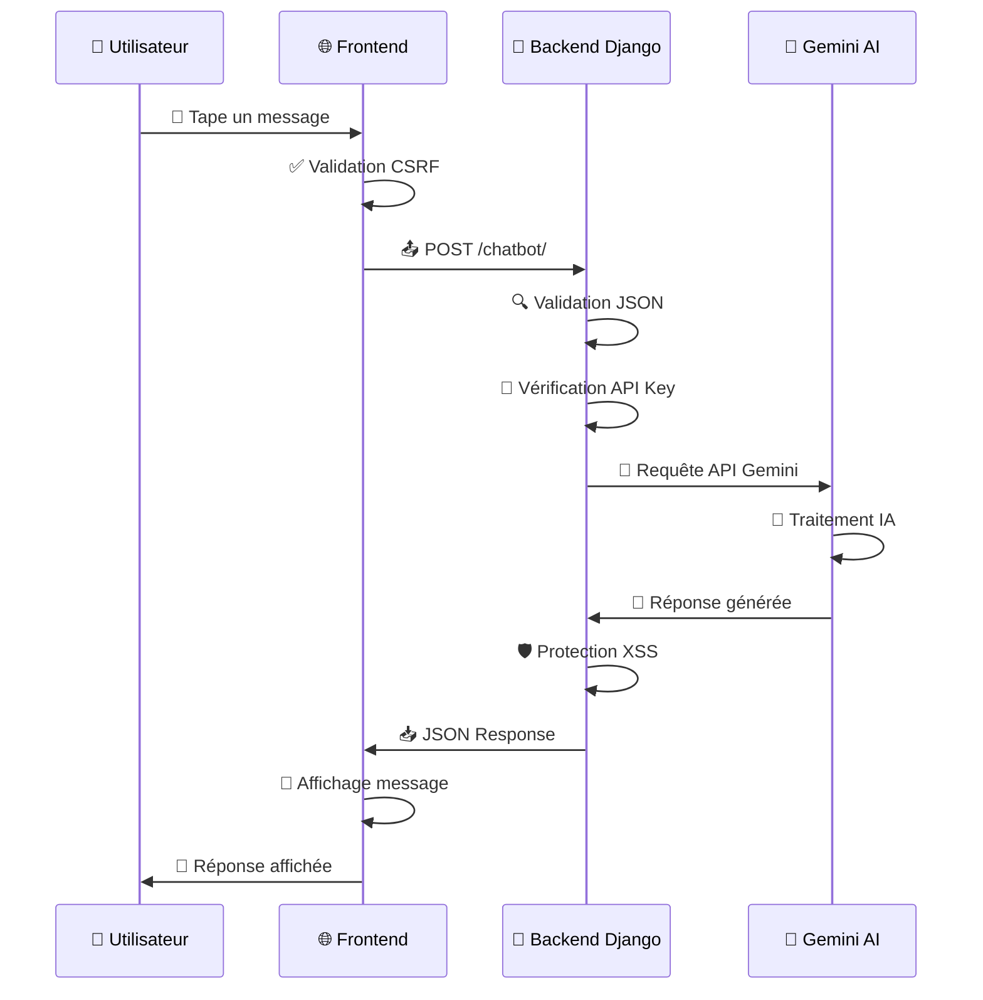

</details>

#### 🔄 Flux du Chatbot

```
┌─────────────┐
│  👤 USER    │
└──────┬──────┘
       │ 💬 Message
       ▼
┌─────────────────┐
│  🎨 INTERFACE   │
│  ├─ Validation  │
│  └─ CSRF Token  │
└──────┬──────────┘
       │ POST /chatbot/
       ▼
┌─────────────────┐
│  🔵 DJANGO      │
│  ├─ Parse JSON  │
│  ├─ Validate    │
│  └─ Configure   │
└──────┬──────────┘
       │ API Call
       ▼
┌─────────────────┐
│  🤖 GEMINI AI   │
│  ├─ Process     │
│  └─ Generate    │
└──────┬──────────┘
       │ Response
       ▼
┌─────────────────┐
│  🔵 DJANGO      │
│  ├─ Sanitize    │
│  └─ Format      │
└──────┬──────────┘
       │ JSON
       ▼
┌─────────────────┐
│  🎨 INTERFACE   │
│  ├─ Display     │
│  └─ Animate     │
└──────┬──────────┘
       │ 💬 Réponse
       ▼
┌─────────────┐
│  👤 USER    │
└─────────────┘
```

#### 📊 Caractéristiques

| Fonctionnalité | Description | Statut |
|---------------|-------------|--------|
| 💬 **Interface Moderne** | Design animé et responsive | ✅ |
| 🧠 **IA Gemini** | Réponses intelligentes | ✅ |
| 🎯 **Contexte** | Personnalisé pour Uranus Group | ✅ |
| ⚡ **Performance** | Réponses rapides (gemini-2.5-flash) | ✅ |
| 🔒 **Sécurité** | CSRF, validation, XSS protection | ✅ |
| 📱 **Mobile** | Interface responsive | ✅ |

---

## 🛠️ Technologies

### 📊 Stack Technologique

<details>
<summary><b>📊 Schéma Architecture Technique - Cliquez pour voir</b></summary>

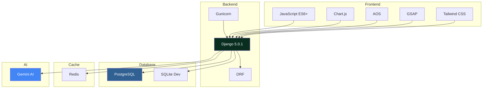

</details>

### 🔧 Backend

```
┌─────────────────────────────────────────┐
│  🔵 DJANGO 5.0.1                        │
│  ├─ Framework web principal            │
│  ├─ ORM pour base de données           │
│  ├─ Système d'authentification         │
│  └─ Admin interface                     │
│                                         │
│  🔌 DJANGO REST FRAMEWORK              │
│  ├─ API REST complète                   │
│  ├─ Serializers                         │
│  └─ ViewSets                            │
│                                         │
│  🗄️ BASE DE DONNÉES                    │
│  ├─ PostgreSQL (Production)            │
│  └─ SQLite (Développement)              │
│                                         │
│  ⚡ CACHE                               │
│  └─ Redis (Production)                  │
│                                         │
│  🚀 SERVEUR WSGI                        │
│  └─ Gunicorn                            │
└─────────────────────────────────────────┘
```

### 🎨 Frontend

```
┌─────────────────────────────────────────┐
│  🎨 TAILWIND CSS                        │
│  ├─ Framework CSS utilitaire            │
│  ├─ Design responsive                   │
│  └─ Personnalisation facile             │
│                                         │
│  ✨ GSAP 3.12.5                         │
│  ├─ Animations avancées                 │
│  ├─ ScrollTrigger                       │
│  └─ Timeline                            │
│                                         │
│  📊 CHART.JS                            │
│  ├─ Graphiques interactifs              │
│  ├─ Statistiques                        │
│  └─ Visualisations                      │
│                                         │
│  🎭 AOS                                 │
│  └─ Animations au scroll                │
└─────────────────────────────────────────┘
```

### 🤖 IA & Outils

```
┌─────────────────────────────────────────┐
│  🤖 GOOGLE GEMINI AI                    │
│  ├─ Modèle: gemini-2.5-flash           │
│  ├─ Réponses intelligentes              │
│  └─ Contexte personnalisé               │
│                                         │
│  📄 REPORTLAB                           │
│  └─ Génération PDF                      │
│                                         │
│  🖼️ PILLOW                              │
│  └─ Traitement d'images                 │
│                                         │
│  🔐 PYTHON-DECOUPLE                     │
│  └─ Variables d'environnement           │
└─────────────────────────────────────────┘
```

---

## 🚀 Installation

### 📊 Schéma d'Installation

<details>
<summary><b>📊 Processus d'Installation - Cliquez pour voir</b></summary>

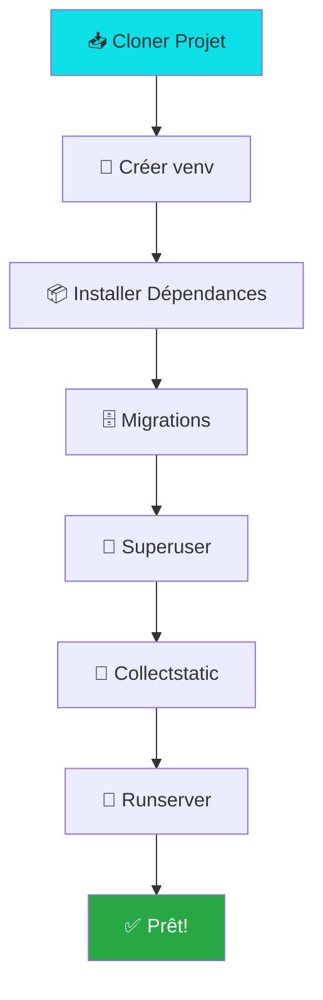

</details>

### 🔧 Étapes Détaillées

<div style="background: #0A1A2F; color: #0DE1E7; padding: 20px; border-radius: 10px; margin: 20px 0;">

```bash
# ┌─────────────────────────────────────────┐
# │  ÉTAPE 1: PRÉPARATION                   │
# └─────────────────────────────────────────┘
cd /home/maxime/newC_uranusgroup_V

# ┌─────────────────────────────────────────┐
# │  ÉTAPE 2: ENVIRONNEMENT VIRTUEL        │
# └─────────────────────────────────────────┘
python3 -m venv venv
source venv/bin/activate  # Linux/Mac
# venv\Scripts\activate    # Windows

# ┌─────────────────────────────────────────┐
# │  ÉTAPE 3: DÉPENDANCES                   │
# └─────────────────────────────────────────┘
pip install -r requirements.txt

# ┌─────────────────────────────────────────┐
# │  ÉTAPE 4: BASE DE DONNÉES               │
# └─────────────────────────────────────────┘
python manage.py makemigrations
python manage.py migrate

# ┌─────────────────────────────────────────┐
# │  ÉTAPE 5: SUPERUTILISATEUR              │
# └─────────────────────────────────────────┘
python manage.py createsuperuser

# ┌─────────────────────────────────────────┐
# │  ÉTAPE 6: FICHIERS STATIQUES           │
# └─────────────────────────────────────────┘
python manage.py collectstatic --noinput

# ┌─────────────────────────────────────────┐
# │  ÉTAPE 7: LANCER LE SERVEUR             │
# └─────────────────────────────────────────┘
python manage.py runserver
```

</div>

### 🎯 Accès

```
┌─────────────────────────────────────────────┐
│  🌐 URLS D'ACCÈS                            │
├─────────────────────────────────────────────┤
│  Site web:      http://127.0.0.1:8000/     │
│  Admin Django:  http://127.0.0.1:8000/admin/│
│  Dashboard:     http://127.0.0.1:8000/      │
│                dashboard/admin/             │
│  API REST:      http://127.0.0.1:8000/api/ │
│  Health Check: http://127.0.0.1:8000/      │
│                health/                      │
└─────────────────────────────────────────────┘
```

---

## ⚙️ Configuration

### 🔑 Variables d'Environnement

<details>
<summary><b>📊 Schéma Configuration - Cliquez pour voir</b></summary>

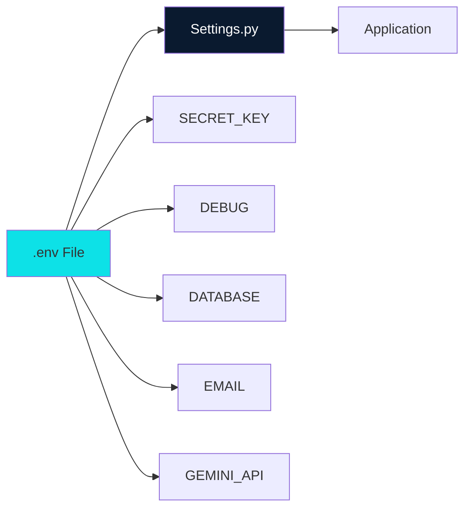

</details>

#### 📝 Fichier .env

```
┌─────────────────────────────────────────────────┐
│  🔐 SÉCURITÉ                                    │
│  SECRET_KEY=votre-clé-secrète                  │
│  DEBUG=True                                     │
│  ALLOWED_HOSTS=localhost,127.0.0.1             │
│                                                 │
│  🗄️ BASE DE DONNÉES (Production)               │
│  DB_NAME=uranusgroup                           │
│  DB_USER=postgres                               │
│  DB_PASSWORD=votre-mot-de-passe                │
│  DB_HOST=localhost                              │
│  DB_PORT=5432                                   │
│                                                 │
│  📧 EMAIL                                       │
│  EMAIL_HOST=smtp.gmail.com                     │
│  EMAIL_PORT=587                                 │
│  EMAIL_USE_TLS=True                            │
│  EMAIL_HOST_USER=votre-email@gmail.com         │
│  EMAIL_HOST_PASSWORD=votre-mot-de-passe-app    │
│                                                 │
│  🤖 GEMINI AI                                   │
│  GEMINI_API_KEY=votre-clé-api-gemini           │
│                                                 │
│  ⚡ REDIS (Production)                          │
│  REDIS_URL=redis://127.0.0.1:6379/1            │
└─────────────────────────────────────────────────┘
```

---

## 🔒 Sécurité

### 🛡️ Schéma de Protection

<details>
<summary><b>📊 Architecture de Sécurité - Cliquez pour voir</b></summary>

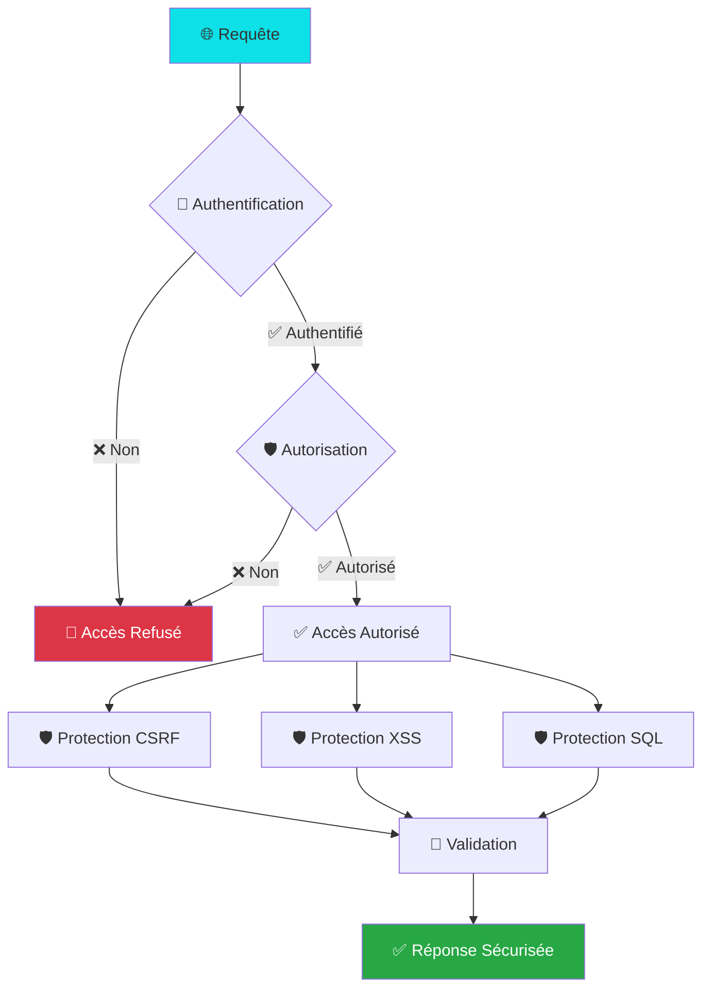

</details>

### 📊 Tableau de Protection

| Protection | Méthode | Statut | Description |
|-----------|---------|--------|-------------|
| 🔐 **CSRF** | Middleware Django | ✅ | Tokens sur tous les formulaires |
| 🛡️ **XSS** | Échappement auto | ✅ | Templates Django sécurisés |
| 💉 **SQL Injection** | ORM Django | ✅ | Requêtes paramétrées |
| 🔒 **Authentification** | Django Auth | ✅ | Hashage bcrypt |
| 👮 **Autorisation** | Système de rôles | ✅ | Permissions granulaires |
| 🍪 **Sessions** | Cookies sécurisés | ✅ | HttpOnly, Secure |

### 🧪 Tests de Sécurité

```
┌─────────────────────────────────────────┐
│  🔍 TESTS DISPONIBLES                   │
├─────────────────────────────────────────┤
│  ✅ Audit de configuration              │
│  ✅ Tests de pénétration                │
│  ✅ Tests chatbot                       │
│  ✅ Tests CSRF                          │
│  ✅ Tests XSS                           │
│  ✅ Tests SQL Injection                 │
│  ✅ Tests authentification              │
└─────────────────────────────────────────┘

📊 Score Global: 75% ✅
```

---

## 📊 Architecture

### 🏗️ Structure du Projet

<details>
<summary><b>📊 Arborescence Complète - Cliquez pour voir</b></summary>

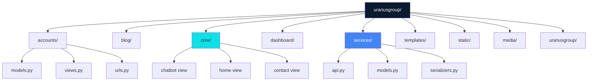

</details>

### 📁 Structure Détaillée

```
uranusgroup/
│
├── 📂 accounts/              # 👤 Gestion utilisateurs
│   ├── models.py            # User, UserProfile
│   ├── views.py             # Auth, profil
│   └── urls.py
│
├── 📂 blog/                  # 📰 Blog/CMS
│   ├── models.py            # Article, Category
│   ├── views.py
│   └── urls.py
│
├── 📂 core/                  # 🏠 Pages principales
│   ├── models.py            # Contact, Team, Slider
│   ├── views.py             # Home, contact, chatbot
│   └── urls.py
│
├── 📂 dashboard/             # 🛡️ Dashboard admin
│   ├── models.py            # Notification, Ticket
│   ├── views.py             # Vues admin
│   └── urls.py
│
├── 📂 services/              # 💼 Services QHSE/Info
│   ├── models.py            # Service, Request, Deliverable
│   ├── api.py               # API REST
│   ├── serializers.py
│   └── urls.py
│
├── 📂 templates/             # 🎨 Templates HTML
│   ├── base.html
│   ├── accounts/
│   ├── blog/
│   ├── core/
│   ├── dashboard/
│   └── services/
│
├── 📂 static/                # 🎨 Fichiers statiques
│   ├── css/
│   ├── js/
│   └── images/
│
└── 📂 uranusgroup/           # ⚙️ Configuration
    ├── settings.py
    ├── settings_production.py
    └── urls.py
```

### 🔄 Flux de Données

<details>
<summary><b>📊 Flux Complet - Cliquez pour voir</b></summary>

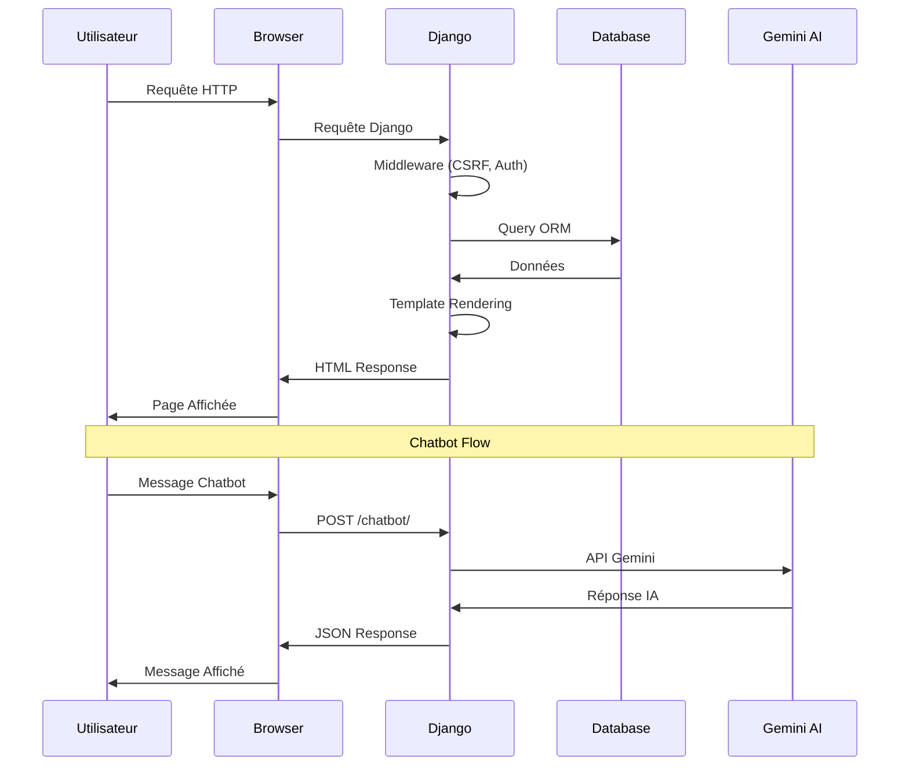

</details>

---

## 🌐 Déploiement

### 🚀 Processus de Déploiement

<details>
<summary><b>📊 Schéma Déploiement - Cliquez pour voir</b></summary>

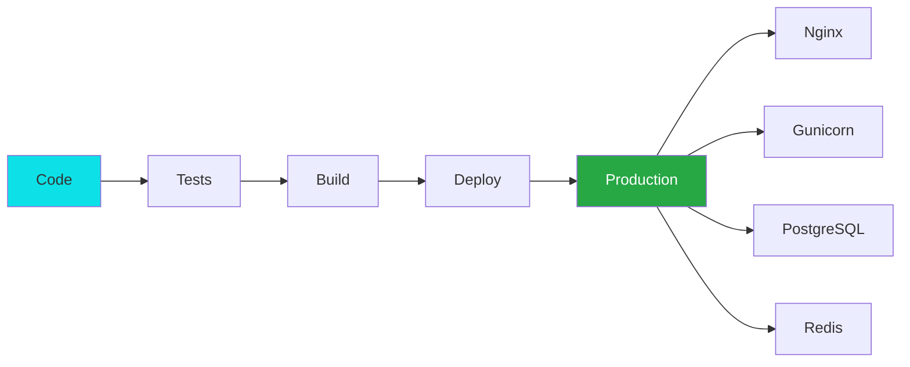

</details>

### 📋 Checklist

```
┌─────────────────────────────────────────┐
│  ✅ CHECKLIST DÉPLOIEMENT               │
├─────────────────────────────────────────┤
│  [ ] Générer SECRET_KEY                 │
│  [ ] DEBUG = False                      │
│  [ ] Configurer ALLOWED_HOSTS           │
│  [ ] Configurer PostgreSQL              │
│  [ ] Configurer Redis                   │
│  [ ] Configurer SMTP                    │
│  [ ] Configurer Gemini API              │
│  [ ] Collectstatic                      │
│  [ ] Configurer Nginx                   │
│  [ ] Configurer Gunicorn                │
│  [ ] Obtenir SSL                        │
│  [ ] Tests de sécurité                  │
│  [ ] Backup                             │
└─────────────────────────────────────────┘
```

---

## 🧪 Tests

### 📊 Schéma de Tests

<details>
<summary><b>📊 Architecture Tests - Cliquez pour voir</b></summary>

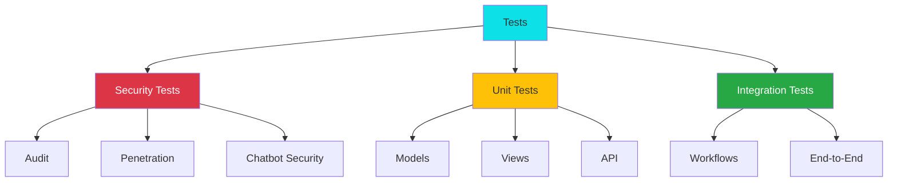

</details>

### 🧪 Commandes de Test

```
┌─────────────────────────────────────────┐
│  🔍 TESTS DE SÉCURITÉ                   │
├─────────────────────────────────────────┤
│  ./run_full_pentest.sh                  │
│  python security_audit.py               │
│  python security_tests.py               │
│  python chatbot_security_tests.py       │
│                                         │
│  ✅ TESTS DJANGO                        │
│  python manage.py test                  │
│  python manage.py test accounts        │
│  python manage.py test services         │
└─────────────────────────────────────────┘
```

---

## 📚 Documentation

### 📄 Documents Disponibles

```
┌─────────────────────────────────────────┐
│  📚 DOCUMENTATION                       │
├─────────────────────────────────────────┤
│  📊 ANALYSE_PROJET.md                   │
│  🔒 PENTEST_REPORT.md                   │
│  🚀 DEPLOYMENT.md                       │
│  ✅ PRODUCTION_CHECKLIST.md             │
│  🤖 CHATBOT_README.md                   │
│  🛡️ ADMIN_FEATURES.md                   │
│  🔐 SECURITY_SUMMARY.md                 │
└─────────────────────────────────────────┘
```

---

<div align="center">

### ⭐ Si ce projet vous a aidé, n'hésitez pas à lui donner une étoile !

**Fait avec ❤️ par l'équipe Uranus Group**

[⬆ Retour en haut](#-uranus-group---plateforme-web-professionnelle)

</div>

---

<div align="center" style="margin-top: 50px; padding: 20px; background: linear-gradient(135deg, #0A1A2F 0%, #1a2f4f 100%); border-radius: 10px; color: #0DE1E7;">

**🚀 Prêt à démarrer ? Suivez le guide d'installation ci-dessus !**

</div>
